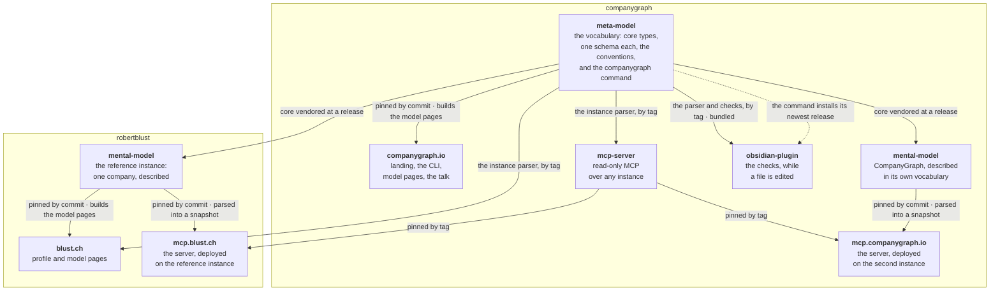

# CompanyGraph

**The open-source meta-model for operating a company.** → [**companygraph.io**](https://companygraph.io)

A company's knowledge is scattered across wikis, decks, tickets and chat threads — each with its own structure, its own half-truth, and nothing that can check any of it. CompanyGraph is the structure that knowledge takes instead: one Markdown file per entity, in folders named for their type, with schemas saying what each type carries. People can read it, and agents can rely on it.

It is not invented. It is the generalization of a model that already works in two places that never knew about each other — a multi-person company, and a company of one. Both arrived at the same shape.

## 🧭 Where to start

| Repository | What it is |
| --- | --- |
| [**meta-model**](https://github.com/companygraph/meta-model) | The vocabulary: core types, one schema per type, the conventions that make a graph of Markdown files checkable, a worked example, and the `companygraph` command that makes an instance, keeps it current and installs the Obsidian plugin, from a menu or by name |
| [**mental-model**](https://github.com/companygraph/mental-model) | CompanyGraph described in its own vocabulary — the second instance, and the one with no people in it |
| [**mcp-server**](https://github.com/companygraph/mcp-server) | A read-only MCP server over any instance: an agent asks which types a company declares, what one entity says and what evidence a claim rests on, and every answer is what the model says at one commit |
| [**mcp-companygraph-io**](https://github.com/companygraph/mcp-companygraph-io) | The MCP server running on CompanyGraph's own model, at [mcp.companygraph.io](https://mcp.companygraph.io/mcp), the address to give a client; every answer is what that model says at one pinned commit |
| [**obsidian-plugin**](https://github.com/companygraph/obsidian-plugin) | An Obsidian plugin for any instance: the meta-model's checks while a file is edited, and completion for what its schemas declare; the meta-model's command installs it |
| [**companygraph.github.io**](https://github.com/companygraph/companygraph.github.io) | The site at [companygraph.io](https://companygraph.io) — landing page, the [CLI](https://companygraph.io/cli/), the [talk](https://companygraph.io/talks/intro/), billing and privacy |

**New here?** The [twelve-minute introduction](https://companygraph.io/talks/intro/) is the fastest way in: why a company's knowledge lives everywhere and nowhere, what two companies that never met both arrived at, and what is written today. DE · EN.

## 🧩 How it fits together

One repository defines the vocabulary; everything else takes it. An instance is a folder of Markdown that vendors `core/` at a release and records which one, so a graph written last year still says what it meant. A site pins the repository it renders by commit, so a page and the model it was built from move together on purpose.

The dotted line is the one that is not a pin: the command fetches the plugin's newest release when it runs, because the plugin already pins the meta-model and a pin back would make each release wait on the other. The meta-model is the only thing anything else depends on, and it depends on nothing. That is what lets an instance live in a repository of its own, under its own license, on a machine that never runs any of this.

## 🧱 Principles

- **One Markdown file per entity** — frontmatter for the fields, a Markdown body for the prose. A document holding many entities as headings has no name to reference any of them by
- **An entity is a file when it owns nothing, and a folder when it owns collections of its own** — one mechanism, not two
- **The canonical name of an entity is its H1** — not a `name` field, not the filename, and no fallback chain between them
- **Every reference is by canonical name, never by path** — moving a file breaks nothing, and renaming an entity breaks loudly rather than quietly
- **Schemas are Markdown, read by agents and by the checker alike** — not a stage on the way to JSON Schema, and no second format kept for the checker
- **Apache 2.0** — the meta-model is open source and stays that way

Core defines a type without obliging you to populate it: a company that does not group what its people have achieved writes no `achievement-kind`, and the type stays in core either way. A **pack** is for vocabulary a kind of company would not have at all — [what a pack is →](https://github.com/companygraph/meta-model#packs)

## 🗺️ Where we are

1. ✅ **The person cluster** — `profile`, `experience`, `skill`, `proficiency-level` and
   `value`, the conventions that make them checkable, and a worked example. One person
   described completely, rather than every type partially.
2. ✅ **The reference instance** — a real company described in this vocabulary:
   [`robertblust/mental-model`](https://github.com/robertblust/mental-model), a company of
   one, laid out by hand before the tooling existed. What it taught is §7 of
   [its spec](https://github.com/companygraph/meta-model/blob/main/docs/superpowers/specs/2026-08-26-reference-instance-design.md).
3. **The rest of core** — `identity` and `vision` shipped in 0.4.1, which is what let an
   instance name the company it describes and say where it is going, `experience-kind` in
   0.6.0, `surface` in 0.16.0, then direction's `strategic-objective` and `strategy` in
   0.21.0, organization's `role` in 0.23.0, operation's `process` and `phase` in 0.25.0,
   `achievement-kind` in 0.28.0, operation's `track` in 0.33.0, and `product`, `feature`,
   `domain` and `concept` in 0.37.0; still ahead are `kpi`, `brand-element`, `group`, the
   `gate` and `rule` that complete operation, and the whole of market and obligation.
4. **Packs** — the mechanism above, deliberately undesigned until a second kind of company
   asks for one.
5. ✅ **Tooling** — the `companygraph` command, shipped inside the meta-model rather than in a
   repository of its own, and run from a release tag as
   `npx github:companygraph/meta-model#<tag>`. Run with nothing after it at a terminal, it opens
   a menu over everything it does and stays open until Quit, so making a model, checking it and
   putting the editor in front of it is one run; [companygraph.io/cli](https://companygraph.io/cli/)
   plays it. Each entry is also a command by name, for a script or a CI step: `init` writes an
   instance that passes the checks on its first day, `upgrade` moves its vendored core, its
   skills, its manifest and its workflow's tag together, `check` runs the mechanical checks,
   and `obsidian` installs the Obsidian plugin's newest release in a vault or updates it there.
   `init` also installs three agent skills for Claude: validating an instance against its
   schemas' writing rules, exporting it for an agent and for Gemini Notebook, and producing a
   surface the model records.
   Writing a new entity from its schema, the `add` [the design](https://github.com/companygraph/meta-model/blob/main/docs/superpowers/specs/2026-08-25-companygraph-tooling-design.md)
   named, is not built.
6. ✅ **The checker** — the checks that are about an instance rather than about the meta-model
   ship as `companygraph-meta-model/checks`, and an instance runs them through a reusable
   workflow at the release its manifest names. They read the schemas from the core your
   instance vendored, never from the core in the package, so the Markdown schemas are their
   source of truth — safe because the meta-model's own suite holds every schema to its fixed
   shape. What they cannot read, a schema's writing rules, stays with an agent. The tooling's
   `check` runs these same checks.
7. ✅ **The MCP server** — [`companygraph/mcp-server`](https://github.com/companygraph/mcp-server),
   the way an agent reaches a model without being handed the files. It asks which types a
   company declares, what one entity says and what evidence a claim rests on, read-only, and
   every answer is what the model says at one commit. It parses a snapshot with the meta-model's
   own parser, so a new type in core arrives without a change to the server and it knows no
   instance's names or facts. The reference instance runs it at
   [mcp.blust.ch](https://mcp.blust.ch/mcp), published to the MCP Registry as
   `ch.blust/mental-model`, and the second instance runs it at
   [mcp.companygraph.io](https://mcp.companygraph.io/mcp), published as
   `io.companygraph/mental-model`.
8. ✅ **The Obsidian plugin** — [`companygraph/obsidian-plugin`](https://github.com/companygraph/obsidian-plugin),
   the checks an instance runs, shown while a file is edited, with completion for what the
   schemas declare and a rename that follows an entity's name everywhere it is used. It bundles
   the meta-model's own checker, so a new rule in core reaches the editor without code of its
   own, and it refuses a vault whose core is newer than the checker it carries rather than
   check it against rules it does not know. It is not in Obsidian's community directory; the
   meta-model's command installs it.
9. ✅ **The second instance** — [`companygraph/mental-model`](https://github.com/companygraph/mental-model),
   CompanyGraph described in the vocabulary it publishes. The reference instance showed the
   vocabulary holds a real company; it could not show that it holds one that is not a person,
   and this one has no people in it. It describes its own product, features and concepts too.

[companygraph.io](https://companygraph.io) is the home page. The meta-model and its tooling are open source and stay that way; consulting is the one thing that costs money — [how it is billed →](https://companygraph.io/billing/)

---

*Built spec-first in the open. Early days — star [meta-model](https://github.com/companygraph/meta-model) to follow along.*
